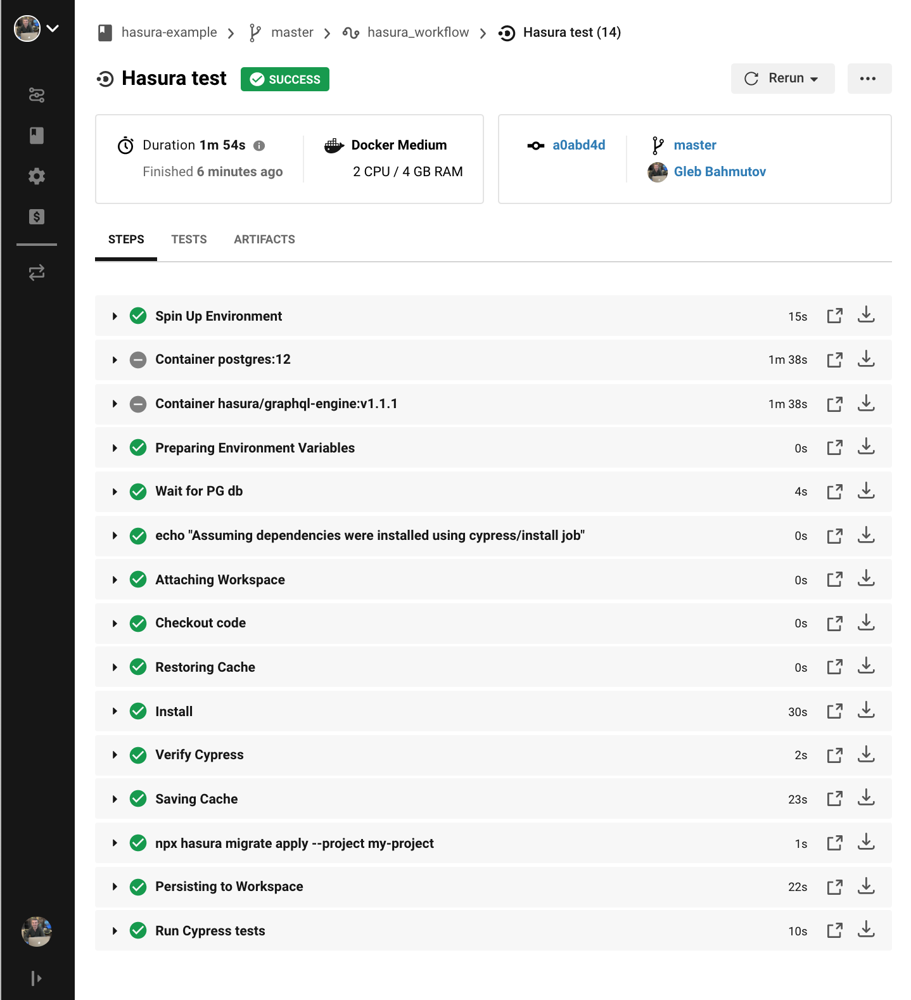

# hasura-example [](https://circleci.com/gh/bahmutov/hasura-example/tree/master)

A small project that runs Postgres database, with [Hasura](https://hasura.io/) GraphQL engine on top and then tests it using Cypress [cy.request](https://on.cypress.io/request) calls.

## Local setup

To run locally requires `docker-compose`:

```shell
docker-compose up -d
# check with
docker ps
```

You can start local Hasura console with

```shell
npm install
npx hasura console --project my-project/
```

and open `http://localhost:9695/` in the browser.

Even without the console, you can make GraphQL calls to `http://localhost:8080/v1/graphql` because the Docker container with Hasura engine is running with port 8080.

While Docker containers are up, start Cypress and run [cypress/integration](cypress/integration) tests

```shell
npx cypress open
```

To stop local Docker containers

```shell
docker-compose stop
```

## CircleCI setup

See [circle.yml](circle.yml) file on how to run the main container with 2 service containers attached using [Cypress CircleCI Orb](https://github.com/cypress-io/circleci-orb). In short, we define a custom executor with 3 Docker images and use the `cypress/run` job in the workflow

```yml
orbs:
  cypress: cypress-io/cypress@1
executors:
  pg-and-hasura:
    docker:
      - image: cypress/base:12.16.1
      - image: postgres:12
          # env variables
      - image: hasura/graphql-engine:v1.1.1
          # env variables
workflows:
  hasura_workflow:
    jobs:
      - cypress/run:
          executor: pg-and-hasura
            # a few steps
```


